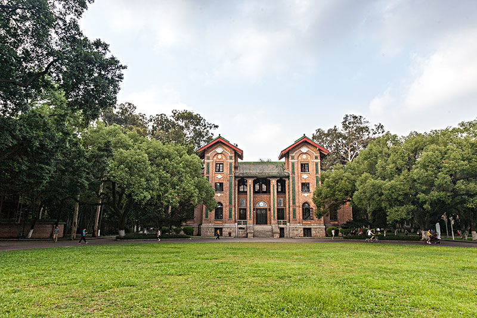

Welcome to Chufeng's personal website!

# Hello!!!
 Say hello to the world from Here!  
 
   
 
 Beijing, China
 
# Introduction of myself

I'm graduated from Sun Yat-sen University.  

    

We have really beautiful views in our campus.   

Right now, I'm living in Beijing, China, and major in Biostatistic in Columbia University.

If you want know more about my academic and professional experience, click here: [about me](about.html)

# That's me

   
 
 The force!

# NYC Restaurant Inspection Results
The New York City Department of Health and Mental Hygiene (DOHMH) conducts unannounced restaurant inspections on an annual basis in order to check for compliance with policies on food handling, food temperature, personal hygiene of restaurant workers, and vermin control. Regulation violations are each worth a pre-specified number of points, which are totaled at the end of the inspection. Scores are converted into grades, where a lower score earns a higher grade.
Here are some plots of the result:[View dashboard](dashboard.html)